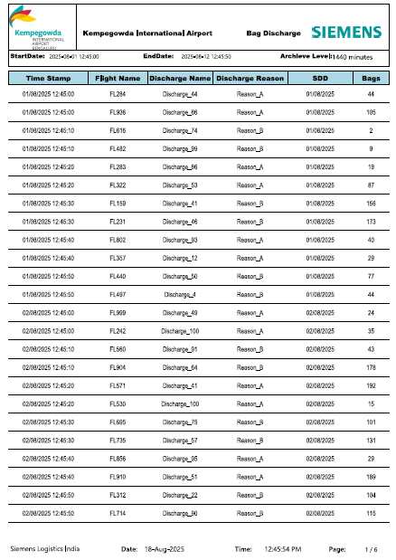

# Live Airport Baggage Discharge Monitoring Dashboard  

This project is a Power BI dashboard integrated with SQL Server for live monitoring of baggage discharge at airports.  

## Features
- Real-time baggage discharge tracking  
- Dynamic visualization of data  
- SSRS integration for pagination & reporting  

## How to Use
1. Open `Dashboard.pbix` in Power BI Desktop  
2. Connect to SQL Server with the provided script in `/Database` folder  
3. Explore live monitoring visuals  

## Screenshots
(https://github.com/FARAZNIA09/Live-Airport-Baggage-Discharge-Monitoring-Dashboard/blob/main/Live-Airport-Baggage-Discharge-Monitoring-Dashboard/Screenshot%202025-08-19%20110137.png)
